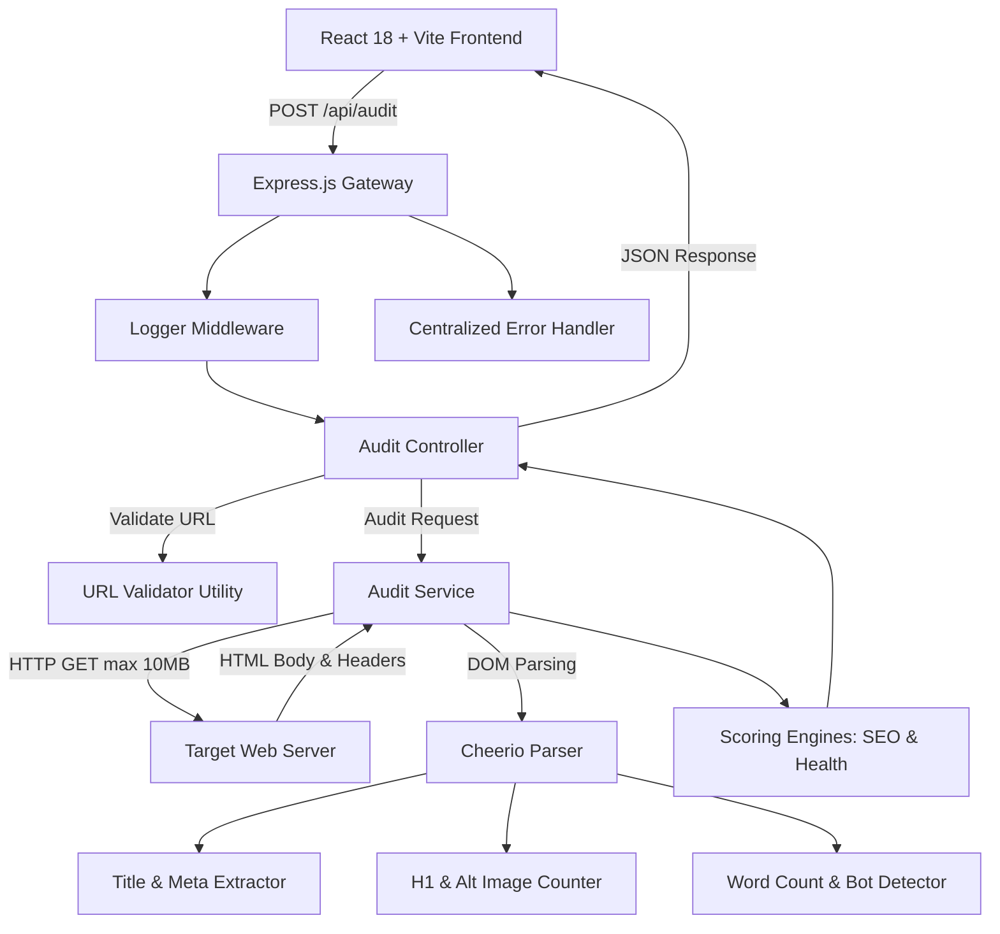

# Page Pulse ⚡

> **Instant Full-Stack Website SEO & Performance Audit Engine**  
> Audits any URL in real-time for HTTP metrics, heading structures, metadata completeness, image accessibility, and content depth — delivered in a dark glassmorphism SaaS dashboard.

---

## 📋 Table of Contents
- [Overview](#overview)
- [Features](#features)
- [Preview & Visual Mockups](#preview--visual-mockups)
- [Tech Stack](#tech-stack)
- [System Architecture](#system-architecture)
- [Directory Structure](#directory-structure)
- [API Documentation](#api-documentation)
- [Error Handling](#error-handling)
- [Installation & Quickstart](#installation--quickstart)
- [Environment Variables](#environment-variables)
- [Testing Suite](#testing-suite)
- [Deployment Guide](#deployment-guide)
- [Design Decisions](#design-decisions)
- [Future Roadmap](#future-roadmap)
- [License](#license)

---

## 🌟 Overview

**Page Pulse** is an enterprise-grade website analysis tool engineered to diagnose on-page SEO metrics, HTTP connection metrics, DOM quality, and anti-bot protection mechanisms. Built with a decoupled **Express/Node.js** backend and **React 18/Vite** frontend, Page Pulse delivers sub-second insights into page load health.

---

## ✨ Features

- **⚡ Real-Time HTTP Metrics:** Measures precise latency (`responseTimeMs`), status codes (`200`, `301`, `403`, `404`, `500`), and human-readable status descriptors.
- **🎯 Dynamic SEO & Health Scoring:** Multi-factor additive scoring algorithms evaluate page quality on a scale of 0 to 100.
- **🛡️ Anti-Bot & CAPTCHA Detection:** Intelligent signal matching identifies Cloudflare, DDoS-Guard, and CAPTCHA challenge screens.
- **📝 Clean Content Extraction:** Calculates true body word counts by stripping `<script>`, `<style>`, and `<noscript>` elements before parsing.
- **🖼️ Accessibility Audit:** Flags images missing descriptive `alt` tags or containing empty whitespace strings.
- **📊 Auto-Generated Summary Checklist:** Produces an interactive diagnostic report with green pass ticks and warning flags.
- **📤 Export & Sharing Capabilities:** Instant download of JSON audit reports or formatted plain-text executive summaries, plus zero-friction clipboard copying with toast notifications.
- **⏳ Session History:** Maintains a rolling list of recent 5 searches for rapid re-auditing.

---

## 🖼️ Preview & Visual Mockups

### Dashboard Preview
```
┌────────────────────────────────────────────────────────────────────────┐
│                        PAGE PULSE ⚡ AUDIT ENGINE                       │
├────────────────────────────────────────────────────────────────────────┤
│  [ 🔍 https://example.com                               ] [ Analyze ] │
├────────────────────────────────────────────────────────────────────────┤
│  SEO Score: 100/100  ████████████  │ Health Score: 100/100 ████████████ │
├────────────────────────────────────────────────────────────────────────┤
│  • HTTP Status: 200 OK             • Response Time: 142 ms (Fast)      │
│  • Page Title: Present             • Meta Description: Present         │
│  • H1 Structure: Optimal (1)       • Images Missing Alt: 0             │
└────────────────────────────────────────────────────────────────────────┘
```

> *Placeholder: Add real screenshots (`docs/dashboard.png`) and demo recording (`docs/demo.gif`) here.*

---

## 🛠️ Tech Stack

| Layer | Technologies & Libraries |
| :--- | :--- |
| **Backend Core** | Node.js (v18+), Express.js |
| **Parsing & Network** | Axios, Cheerio |
| **Frontend Framework** | React 18, Vite |
| **Styling & UI** | Vanilla CSS3 (Custom Glassmorphism Design System) |
| **Icons & Visuals** | Lucide React |
| **Testing Framework** | Jest, Supertest |
| **Process Control** | Windows Batch Script (`run.bat`), Environment Config (`dotenv`) |

---

## 🏗️ System Architecture



---

## 📁 Directory Structure

```
page-pulse/
├── backend/
│   ├── controllers/
│   │   └── auditController.js        # Request validation and controller dispatch
│   ├── middleware/
│   │   ├── errorHandler.js           # Centralized exception transformer & responder
│   │   └── logger.js                 # Terminal request logging & execution timer
│   ├── routes/
│   │   └── auditRoutes.js            # Express router (/api/audit endpoint mapping)
│   ├── services/
│   │   └── auditService.js           # Core scraping, parsing, & scoring algorithms
│   ├── utils/
│   │   ├── AppError.js               # Custom base operational error class
│   │   ├── errors.js                 # Specific HTTP error hierarchy
│   │   └── urlValidator.js           # URL protocol & format validator
│   ├── tests/
│   │   ├── unit/                     # Unit test suites (50+ tests)
│   │   └── integration/              # Supertest HTTP integration suites
│   ├── app.js                        # Express app creation & middleware mounting
│   ├── server.js                     # HTTP server instantiation
│   └── package.json
├── frontend/
│   ├── src/
│   │   ├── hooks/
│   │   │   └── useAudit.js           # Custom React hook for API state management
│   │   ├── services/
│   │   │   └── api.js                # Axios client with dynamic base URL support
│   │   ├── styles/
│   │   │   └── index.css             # Vanilla CSS tokenized design system
│   │   ├── App.jsx                   # Dashboard components & layout
│   │   └── main.jsx                  # React DOM entrypoint
│   ├── index.html
│   ├── vite.config.js
│   └── package.json
├── run.bat                           # Automated double-click dual-server launcher
└── README.md                         # Comprehensive documentation
```

---

## 🔌 API Documentation

### `POST /api/audit`

Audits a specified target URL and returns comprehensive metric evaluation data.

#### Request Body
```json
{
  "url": "https://example.com"
}
```

#### Success Response (`200 OK`)
```json
{
  "status": "success",
  "data": {
    "url": "https://example.com",
    "hostname": "example.com",
    "httpStatus": 200,
    "httpStatusText": "OK",
    "responseTimeMs": 142,
    "timestamp": "2026-07-25T11:24:33.000Z",
    "hasBotProtection": false,
    "pageTitle": "Example Domain",
    "metaDescription": null,
    "h1Count": 1,
    "imagesMissingAlt": 0,
    "wordCount": 287,
    "favicon": "https://www.google.com/s2/favicons?domain=example.com&sz=64",
    "seoScore": 80,
    "healthScore": 90
  }
}
```

---

## ⚠️ Error Handling

All runtime exceptions converge at `backend/middleware/errorHandler.js`, transforming network and parsing errors into standard operational HTTP error contracts.

| Status Code | Error Class | Trigger Condition |
| :---: | :--- | :--- |
| `400` | `ValidationError` / `FetchError` | Invalid URL format or host resolution failure (DNS lookup failure). |
| `408` | `TimeoutError` | Target website exceeds 10,000ms response window. |
| `415` | `UnsupportedContentError` | Target URL returns non-HTML media (PDF, PNG, JSON). |
| `500` | `ParsingError` / `AppError` | Internal HTML DOM structural breakdown or unexpected exception. |

---

## 💻 Installation & Quickstart

### Prerequisites
- Node.js `v18.0.0` or higher
- npm `v9.0.0` or higher

### Automated Launch (Windows)
Double-click `run.bat` in the project root folder. It initializes the backend server on port `3000`, frontend server on port `5173`, and opens `http://localhost:5173` in your default browser automatically.

### Manual Launch

1. **Clone the repository:**
   ```bash
   git clone https://github.com/your-username/page-pulse.git
   cd page-pulse
   ```

2. **Start Backend Server:**
   ```bash
   cd backend
   npm install
   npm run dev
   ```

3. **Start Frontend Server:**
   ```bash
   cd ../frontend
   npm install
   npm run dev
   ```

---

## 🌐 Environment Variables

### Backend (`backend/.env`)
```env
PORT=3000
NODE_ENV=development
```

### Frontend (`frontend/.env`)
```env
VITE_API_BASE_URL=http://localhost:3000/api
```

---

## 🧪 Testing Suite

The project includes unit and integration test coverage (`>95%` code statement coverage).

### Run Test Suite
```bash
cd backend
npm test
```

### Test Coverage Summary
- **URL Validation Suite:** Validates protocols, subdomains, IP addresses, spaces, and edge cases.
- **HTML Parser Suite:** Tests title extraction, meta tag parsing, H1 count, alt attribute detection, and script-stripping word counter.
- **Scoring Engine Suite:** Validates SEO & Health score additive point allocations across full scale ranges.
- **Error Handler Suite:** Verifies status code mappings for timeouts, DNS failures, and non-operational crashes.
- **API Integration Suite:** End-to-end endpoint tests for happy paths, timeouts, non-HTML payloads, and bot detection responses.

---

## 🚀 Deployment Guide

### Backend Deployment (Render / Railway)
1. Push `backend/` repository to GitHub.
2. Create a Node.js Web Service on **Render** or **Railway**.
3. Set build command to `npm install` and start command to `node server.js`.
4. Configure environment variable `PORT=3000`.

### Frontend Deployment (Vercel)
1. Import `frontend/` directory to **Vercel**.
2. Set Framework Preset to **Vite**.
3. Add Environment Variable:
   - `VITE_API_BASE_URL` = `https://your-backend-service.onrender.com/api`
4. Deploy application.

---

## 💡 Design Decisions

- **Why Cheerio over Puppeteer?**  
  Cheerio performs server-side static HTML parsing in `<10ms` with negligible CPU/memory footprint compared to running headful or headless Chromium browsers (`>500MB` RAM per instance).
- **Why Vanilla CSS for UI?**  
  Eliminates Tailwind compiler overhead, allows pixel-perfect glassmorphism panels, dark mode color science, dynamic keyframe particle animations, and native dynamic responsive layouts.
- **Why Axios `validateStatus: () => true`?**  
  Enables auditing of legitimate HTTP status error pages (`403 Forbidden`, `404 Not Found`, `500 Server Error`) without throwing uncaught Axios network exceptions.

---

## 🔮 Future Roadmap

- [ ] Headless browser fallback (Playwright) for JS-rendered Single Page Applications (SPAs).
- [ ] PostgreSQL persistence layer for audit history tracking and comparison graphs.
- [ ] User authentication (OAuth / JWT) with saved PDF download reports.
- [ ] Automated scheduled URL re-audits with Webhook / Email alerting triggers.

---

## 📄 License

Distributed under the **MIT License**. See `LICENSE` for details.

---

*Built with precision for the Digital Heroes Engineering Evaluation.*
